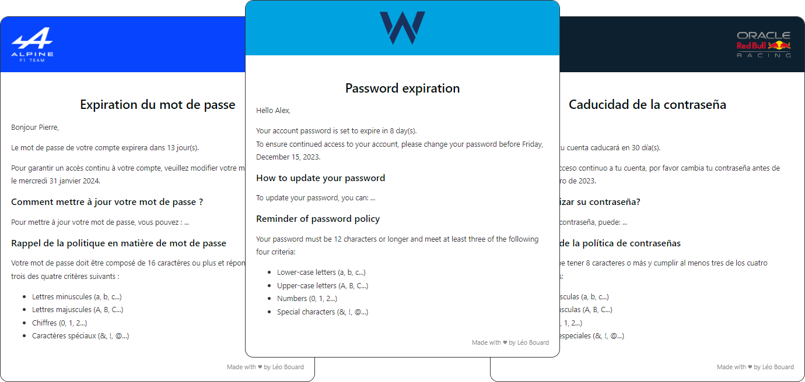

# PasswordReminderByEmail

**This script is written for PowerShell 7+ only!**

Inform your users by email when their password is about to expire with localized messages and easy setup and branding.



> Disclaimer: frequent password expiration isn't recommanded anymore by many security experts

## Quick setup

1. Modify the `PasswordReminderByEmail.ps1` to indicate the sender email address (`From`) and SMTP server (`SmtpServer`) in the `Send-MailMessage` splatting
2. Add or modify translations available in the `templates` folder
3. Edit the `data.json` to apply translations to your users using filters
4. Brand the `layout.html` with your logo and colors
5. Make sure that you have access to fine-grained password policies (container `CN=Password Setting Container`)
6. Do a test run of the script using the parameter `-TestRecipient`
7. If everything is alright, you can put the script into scheduled task

## Features

### Translations

The script support multiple translations. These translations are stored in Markdown files available in the folder `templates`. You can insert PowerShell code and variables directly in the text since it will be expanded.

The `data.json` file is used to assign each user a translation (template) and the email subject. The lowest priority is the one that will be used in case of conflict. Here's an example to target France and Belgium to apply a French translation and a French email subject:

```json
{
    "Template":  "fr",
    "Subject":  "Expiration de votre mot de passe",
    "Filter":  "$_.Country -in 'FR','BE'",
    "Priority":  10
}
```

### Branding

The HTML file uses a table to arrange its elements, to guarantee compatibility with rendering engines that don't use HTML5. You can customize the `layout.html` file to your company colors and logo.

A few examples are available in the folder `mockup`.

#### Header

For the header, you can:

- Add your company logo with `
<tr>
    <td bgcolor="dodgerblue" align="left" style="height:85px;">
    
    </td>
</tr>
```

#### Footer

For the footer, you can replace the "Made with ♥ by Léo Bouard" by your company name for example.

```html
<!-- FOOTER -->
<tr style="border-top: 2px solid #ddd; height: 35px;">
    <td>
    <p style="color: #888; font-size: 12px; line-height: 120%; text-align: right;">Made with ♥ by Léo Bouard</p>
    </td>
</tr>
```

### Available user information

All Active Directory user information are available at anytime in the `ForEach-Object` loop. You can use it directly in the Markdown files used for translation or in the email subjets written in the `data.json` file. Some properties are added to the default user objects:

Property | Value | Type
-------- | ----- | ----
PasswordAge | 165 | Double
MaxPasswordAge | 180 | Double
PasswordExpirationDate | 2024-01-11 09:45:04 | DateTime
DaysBeforeExpiration | 15 | Double
PasswordPolicy | DC=domain,DC=com | AD Default Domain Password Policy or AD Fine Grained Password Policy
Template | default | String

#### Password Policy property

The property on the user object give you full details about the password policy (defaut domain or fine-grained) applied to this user. Here's the reminder of the information that you can find inside this property:

- ComplexityEnabled
- MinPasswordAge
- MinPasswordLength
- PasswordHistoryCount

**Reminder:** Authenticated Users do not have access to fine-grained password policies by default. [How to display fine-grained password policy settings to Authenticated Users? - Synergix Support](https://synergixdesk.zendesk.com/hc/en-us/articles/202927708-How-to-display-fine-grained-password-policy-settings-to-Authenticated-Users-).

## Parameters

Here's the script parameters:

- `-ExpireInDays`: An array of days. The script will filter out users whose passwords won't expire in the next specified number of days.
- `-TestRecipient`: An array of test recipients to receive emails instead of users.
- `-SearchBase`: The distinguished name of the organizational unit that you want to target. The default value is the current domain.
- `-Layout`: The path to the layout email file. The default value is "layout.html" in the script's directory.
- `-LogHistory`: Determine the retention time (in days) of script log files. The default value is 30 days.

### Examples

Send an email to users from "domain.com/CONTOSO" with a password that will expire in 15, 10, 5 and 1 day(s) before its expiration:

```powershell
.\PasswordReminderByEmail.ps1 -ExpireInDays 15,10,5,1 -SearchBase 'OU=CONTOSO,DC=domain,DC=com' -Verbose
```

Send a test email to <test@domain.com> for users with a password that will expire in the next 10 days :

```powershell
$exp = 10,9,8,7,6,5,4,3,2,1
.\PasswordReminderByEmail.ps1 -ExpireInDays $exp -TestRecipient 'test@domain.com'
```

### As a scheduled task

This script has been created for use in a scheduled task. You can create one with a daily trigger and the following action:

- Program/script: `"C:\Program Files\PowerShell\7\pwsh.exe"`
- Add arguments (optional): `-Command "& 'C:\scripts\PasswordReminderByEmail\PasswordReminderByEmail.ps1' -ExpireInDays 15,10,5,1 -Verbose"`
